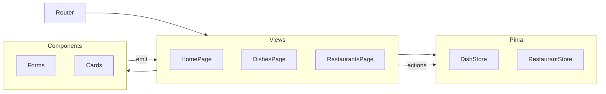

# ToEat

Клиентское SPA: учёт ресторанов и блюд. Стек: Vue 3, TypeScript, Vite 3, Vue Router 4, Pinia 2, Bulma (Sass). Данные только в памяти браузера, **бэкенда нет** — состояние сбрасывается при перезагрузке страницы.

Исходный код приложения: [`app/`](app/).

## Содержание

- [Функциональность](#функциональность)
- [Стек](#стек)
- [Сборка и данные](#сборка-и-данные)
- [Запуск](#запуск)
- [Скрипты](#скрипты)
- [Тесты и статический анализ](#тесты-и-статический-анализ)
- [Архитектура](#архитектура)
- [Каталоги](#каталоги)
- [Лицензия и атрибуция](#лицензия-и-атрибуция)

## Функциональность

- Маршруты: главная, списки ресторанов и блюд (часть маршрутов с lazy import).
- Списки: просмотр, добавление (форма на странице), удаление записи.
- Фильтрация по подстроке имени (`entityNameMatchesFilter` в `app/src/utils/`).
- Query `?new=true` открывает форму создания (используется с главной).
- Отдельные сообщения UI при пустом списке и при пустом результате фильтра.

## Стек

| Слой        | Технология                               |
| ----------- | ---------------------------------------- |
| UI          | Vue 3, Composition API, `<script setup>` |
| Язык        | TypeScript                               |
| Сборка      | Vite 3                                   |
| Роутинг     | Vue Router 4                             |
| Состояние   | Pinia 2                                  |
| Стили       | Bulma, Sass (`app/src/assets/styles`)    |
| Тесты       | Vitest, jsdom                            |
| Анализ кода | ESLint, Prettier                         |

Зависимости: [`app/package.json`](app/package.json).

## Сборка и данные

- Списки сущностей хранятся в Pinia (`DishStore`, `RestaurantStore`); страницы вызывают actions стора.
- События от форм и карточек к страницам — через типизированные `defineEmits`.
- `npm run build` выполняет `vue-tsc --noEmit`, затем `vite build`.

## Запуск

Требования: Node.js LTS, npm.

```bash
cd app
npm install
npm run dev
```

URL по умолчанию: `http://localhost:3000` (порт в `vite.config.ts`).

## Скрипты

Команды выполняются из каталога `app/`:

| Команда              | Назначение                         |
| -------------------- | ---------------------------------- |
| `npm run dev`        | Режим разработки, HMR              |
| `npm run build`      | Проверка типов + production-сборка |
| `npm run preview`    | Просмотр сборки (порт `4173`)      |
| `npm run type-check` | `vue-tsc --noEmit`                 |
| `npm run test`       | Vitest, один прогон                |
| `npm run test:watch` | Vitest в режиме watch              |
| `npm run lint`       | ESLint                             |

## Тесты и статический анализ

- Файлы `*.test.ts` рядом с кодом: `entityNameMatchesFilter`, actions сторов (добавление / удаление по `id`).
- Доменные типы: `app/src/types.ts`; литералы статусов и карта классов тегов: `app/src/constants.ts`.

Детали по `src/`: [`app/README.md`](app/README.md).

## Архитектура



- Router — сопоставление URL и представлений, при необходимости code splitting.
- Stores — массивы сущностей и изменения через actions.
- Views — локальный UI-стейт страницы (фильтр, показ формы) и вызовы стора.
- Utils — чистые функции для использования во views и в тестах.

## Каталоги

```text
vue_ts/
├── README.md
└── app/
    ├── package.json
    ├── vite.config.ts
    ├── vitest.config.ts
    └── src/
        ├── main.ts
        ├── App.vue
        ├── router/
        ├── views/
        ├── components/
        ├── stores/
        ├── utils/
        ├── types.ts
        └── constants.ts
```
